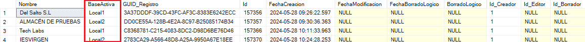

# Introducción

## Datos del proyecto

| Nombre  | Apellidos | Título | Año | Centro |
| ------------- | -------------| ------------- | ------------- | ------------- |
| Alejandro  | del Salto Mimbrera | FletWise  | 2023  | IES Virgen del Carmen  |

## Resumen

Para poder entender la forma en la que vamos a consultar nuestros datos, es importante hacer una breve (quizás no tan breve) introducción.

El proyecto trata de una aplicación cuya función es realizar un mantenimiento del registro de vehículos de distintas empresas, para ello, contaremos con varios usuarios, empresas y por supuesto, vehículos los cuales contarán principalmente con una marca, un modelo y un tipo de combustible, los cuales a su vez, también pertenecen a una empresa en concreto (y el modelo pertenece a una marca determinada).

Contaremos con 2 posibilidades a la hora de iniciar sesión, que el usuario cuente o no con permisos de administración.

En caso de tenerlos, si vista principal (home) contará con acceso a las vistas de gestión de marcas, modelos y combustibles, y en la vista del perfil, donde un usuario puede realizar un cambio de empresa activa entre las diferentes empresas a las que pertenezca, un administrador puede hacer que cualquier empresa sea su empresa activa sin necesidad de pertenecer a ella, esto con la finalidad de poder hacer ajustes de vehiculos, marcas, modelos y combustibles en otras empresas.

Ahora, adentrémonos en cosas más específicas.

Nuestra api será desarrollada en .NET con Entity Framework y haremos uso de un patrón repositorio-servicio además de comenzar mediante un database-first.

Esto significa que vamos a generar nuestro contexto y modelos en base a una base de datos ya creada en SQLServer, y ese contexto junto con los modelos nos permitirán hacer peticiones a nuestra base de datos mediante un repositorio (la capa de acceso directo a los datos), ese repositorio será llamado por un servicio el cual a su vez, será llamado por un controlador, este controlador contará con los endPoints ("funciones" a las cuales llamaremos desde nuestro FrontEnd) con cada una de las funcionalidades necesarias.

El contexto necesita una cadena de conexión para saber hacia que base de datos debe conectarse, hecho que nos será útil ya que con Entity Framework, podemos usar un mismo contexto para consultar varias bases de datos con la única condición de que estas sean copias exactas unas de otras, y lo único que necesitaremos hacer es cambiar la cadena de conexión.

Nosotros contaremos con 3 bases de datos las cuales como dije anteriormente, son copias exactas en cuanto a su estructura y lo único que varía es el contenido que se almacena en ellas.

1 - Registro General, esta base de datos contará con la información relacionada con nuestros usuarios y empresas, es decir, podremos consultar cuantos usuarios y empresas hay, a que empresa o empresas pertenece cada usuario y que empresa tiene activa cada usuario en este preciso instante.

2 - Local1, esta base de datos contará con información de algunas empresas, es decir, contendrá vehículos, marcas, modelos y combustibles pertenecientes a x empresas.

3 - Local2, esta base de datos contará, al igual que Local 1, con vehículos, marcas, modelos y combustibles pertenecientes a x empresas (distintas de las empresas a las que se hace referencia en Local1).

Cabe recalcar que Entity Framework abre una nueva conexión con la base de datos cada vez que se hace una petición y esto nos será útil ya que para cambiar la cadena de conexión y saber hacia que base de datos realizar una petición, el secreto está en que en nuestra tabla de empresas de la base de datos de Registro General, contaremos con un campo llamado BaseActiva, cuyos valores serán Local1 o Local2, es decir, desde nuestra base de datos de registro general, podemos saber en que base de datos se encuentran almacenados los vehículos, marcas, modelos y combustibles de cada empresa.

\pagebreak

Por lo tanto, solo necesitaremos cambiar el campo "database" de nuestra cadena de conexión y sustituirlo por la base activa de la empresa que queramos para así tener la cadena de conexión preparada para ser usada, el último paso sería crear una nueva instancia de nuestro repositorio para que este abra una conexión nueva con la base de datos a partir del contexto, pero esta vez no usará la cadena de conexión predeterminada, sino la cadena modificada que almacenamos anteriormente.

En nuestras bases de datos no se borrarán registros, tan solo se marcarán como borrados (borrado lógico) de tal forma que cuando hagamos peticiones, devolveremos los registros que no estén marcados como borrados.

Contaremos con campos de auditoría, estos muestran quien y cuando se realizan los insert, updates y deletes en la base de datos.

Haremos uso de DTO's - Data Transfer Objects, los cuales nos serán útiles para mostrar al usuario solo la información que necesita un ejemplo sería que al usuario no le interesa saber que un objeto posee un campo llamado borradoLógico.

Para convertir un modelo a DTO y viceversa será necesario realizar mapeos, los cuales serán llevados a cabo usando un paquete NuGet llamado Automapper, este paquete permite optimizar en gran cantidad el proceso de mapeo de objetos.

Nuestra aplicación realizará un paginado, filtrado, búsqueda y ordenación de los registros devueltos desde el BackEnd, eliminando carga de trabajo del FrontEnd ( tutorial de paginado, filtrado, búsqueda y ordenación en [CodeMaze](https://code-maze.com/net-core-series/)).

Nuestra autenticación se realizará mediante un token el cual será generado al hacer login y tendrá una vida útil limitada, en este token se almacenará información de interés como el nombre de usuario, la empresa a la que pertenece y si es un usuario corriente o un administrador, ya que implementaremos permisos adicionales para los administradores.

El token puede ser renovado siempre y cuando hayan pasado menos de 5 minutos desde que caducó.

Para el FrontEnd usaremos Vuejs2 con Vuetify y Axios para las llamadas a la API.

Nuestro FrontEnd no tiene muchas cosas interesantes, lo único que podemos destacar es que consultaremos el token para ver si el usuario posee el rol de administrador y así mostrarles las características ocultas para los usuarios comunes (estas características son el poder administrar marcas, modelos y combustibles y el poder cambiar de empresa activa entre todas las empresas de nuestras bases de datos Local1 y Local2).

Por otro lado, Axios nos permite crear un interceptor que controlará nuestras peticiones tanto antes de realizarlas así como una vez ya han finalizado, de esta forma podemos hacer que antes de cada petición, enviemos nuestro token en las cabeceras de la misma (ya que si una petición se intenta hacer sin token, supondrá el cierre instantáneo de la sesión y la necesidad de realizar un logeo de nuevo ) por otro lado, si enviamos el token y está caducado, nuestra petición no será exitosa y aquí tenemos 2 posibilidades, que nuestro token haya caducado hace más de 5 minutos, lo que irremediablemente conducirá hacia el mismo resultado que si intentamos hacer una petición sin token, sin embargo, en caso de que nuestra petición falle pero nuestro token haya caducado hace menos de 5 minutos, se enviará una petición para tratar de renovarlo  y en caso exitoso, se repetirá la petición que falló en un principio (si falla la renovación del token, simplemente nos mandará a logearnos de nuevo).

Anteriormente se nombró el concepto de empresa activa, esto hace referencia a la empresa seleccionada entre las empresas a las que un usuario pertenece, por lo que al hacer login, la información mostrada en la tabla de vehículos será la correspondiente a esa empresa, teniendo la posibilidad de cambiar a otra empresa activa para poder gestionar los registros pertenecientes a la otra empresa (como dije antes, un administrador puede hacer esto sin necesidad  de pertenecer a ninguna empresa).

\pagebreak
