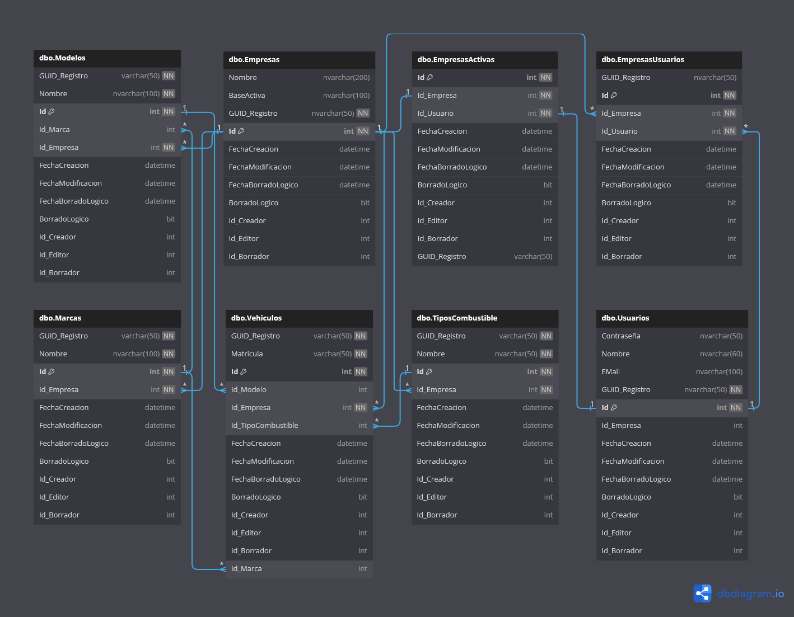

# Análisis

A continuación, el diagrama Uml en el que mostraremos la estructura de nuestra base de datos, cabe recalcar que las relaciones mostradas son simbólicas ya que en la estructura real, no hay relaciones ya que se realizan a nivel de código

Si bien esta práctica no es necesaria llevarla a cabo en el proyecto realizado ( ya que no se acerca ni un poco a la complejidad de un proyecto empresarial real ), me han enseñado que en proyectos grandes, el hecho de tener relaciones en las tablas reduce el rendimiento, por lo que una forma de optimizarlo es mediante la eliminación de dichas relaciones

Al contar con un usuario administrador que puede convertir cualquier empresa en su empresa activa a pesar de no pertenecer a ella, justo en ese caso no cumpliremos con la relación que indica la imposibilidad de que una empresa sea empresa activa para más de un usuario simultáneamente

\pagebreak
