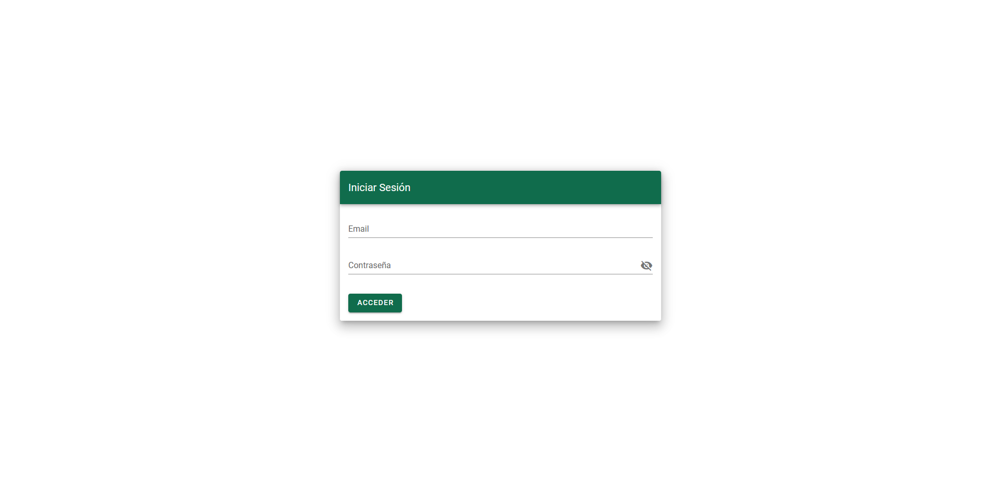
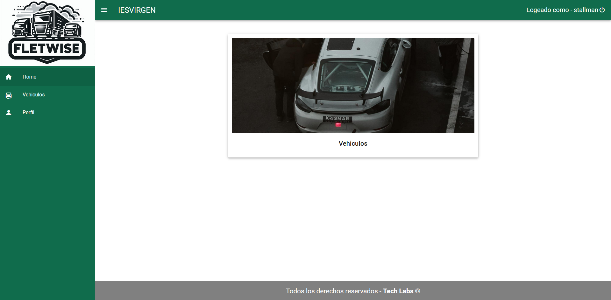
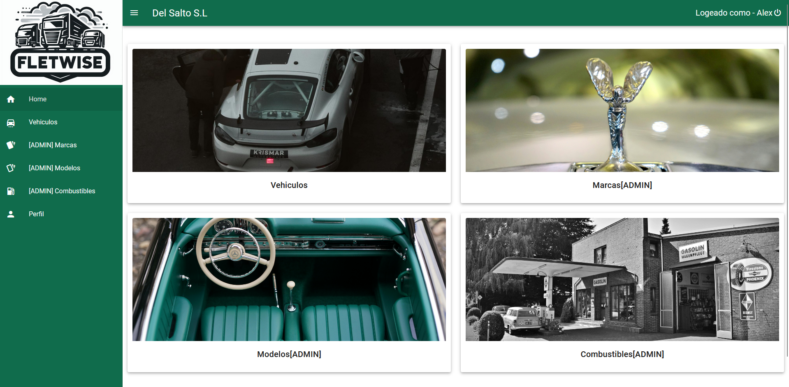
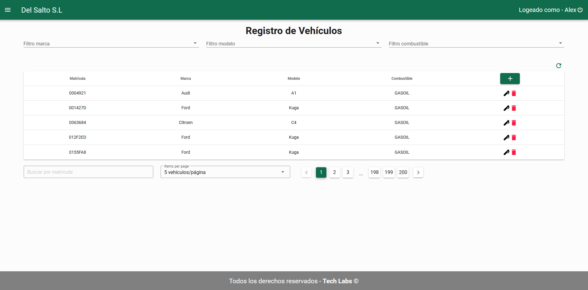
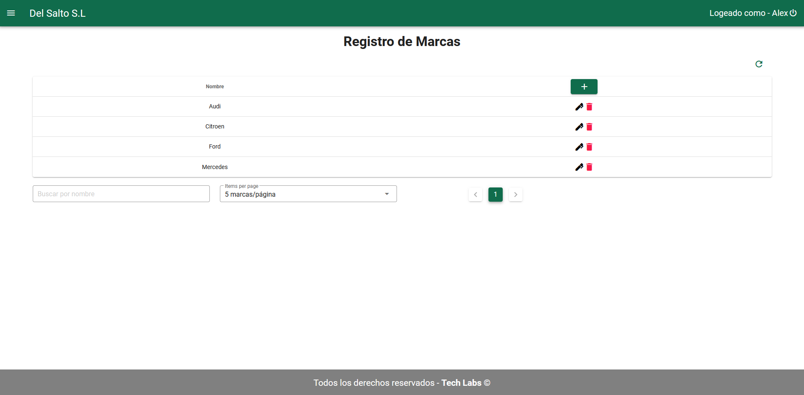
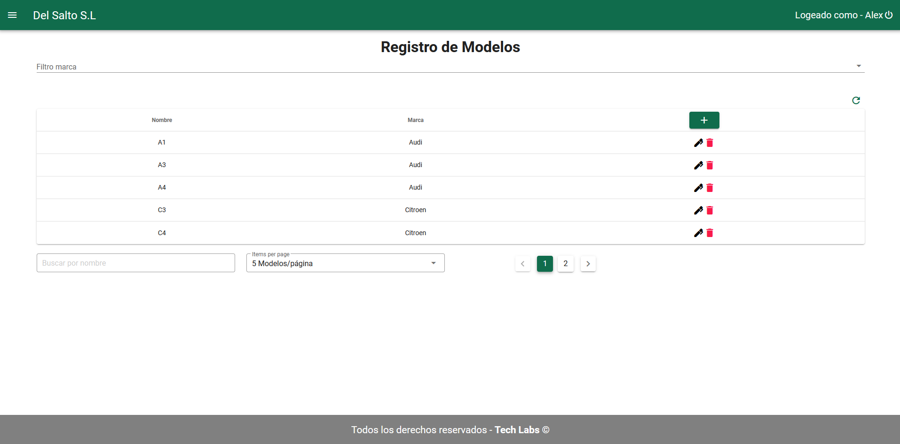
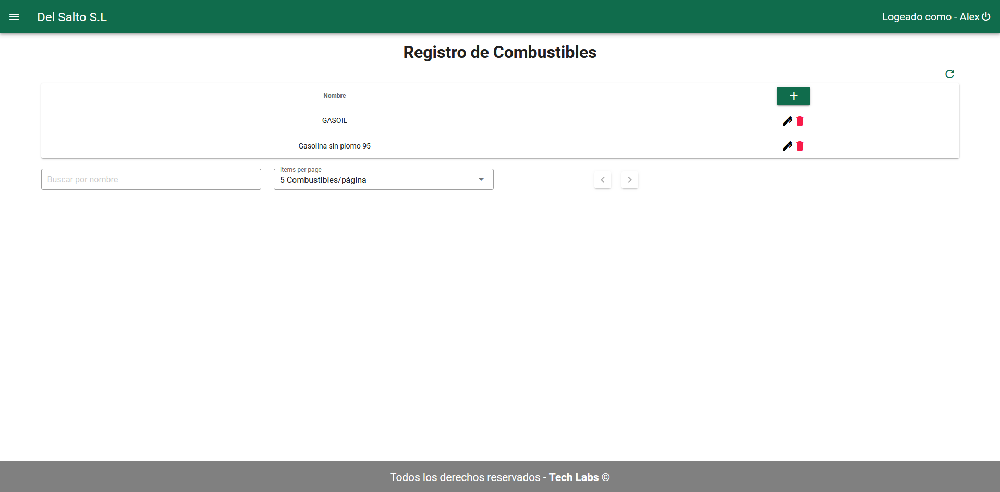
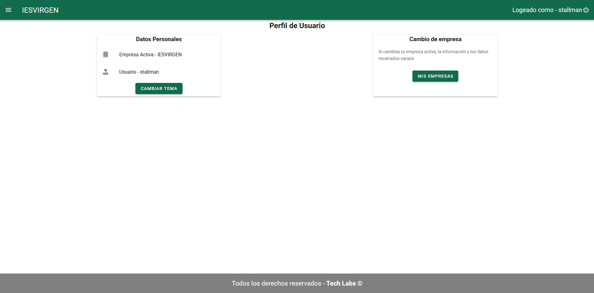
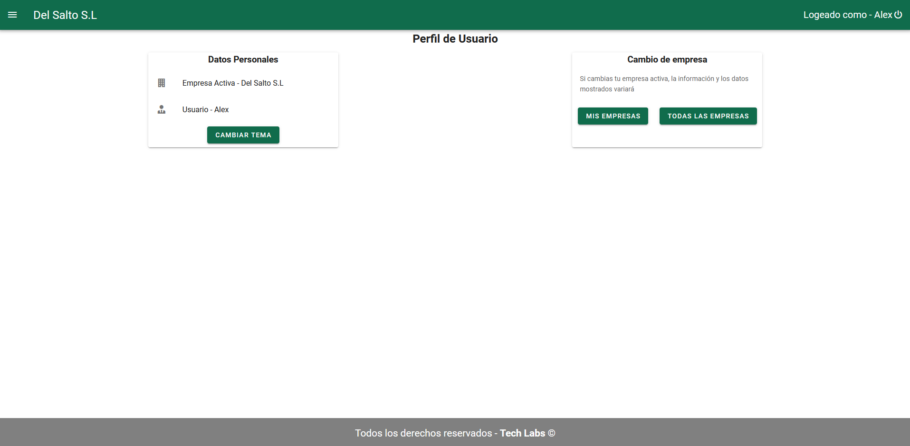

# Apariencia

Aquí se mostrarán las diferentes vistas de nuestra aplicación antes de explicar el contenido y el funcionamiento del código ya que considero que teniendo la apariencia final del proyecto, a la hora de ver el código y los pasos seguidos es más fácil el comprender por que se están llevando a cabo

## Login

## Home - Usuario

## Home - Admin

## Vehiculos

## Marcas

## Modelos

## Combustibles

## Perfil - Usuario

## Perfil - Administrador

\pagebreak
